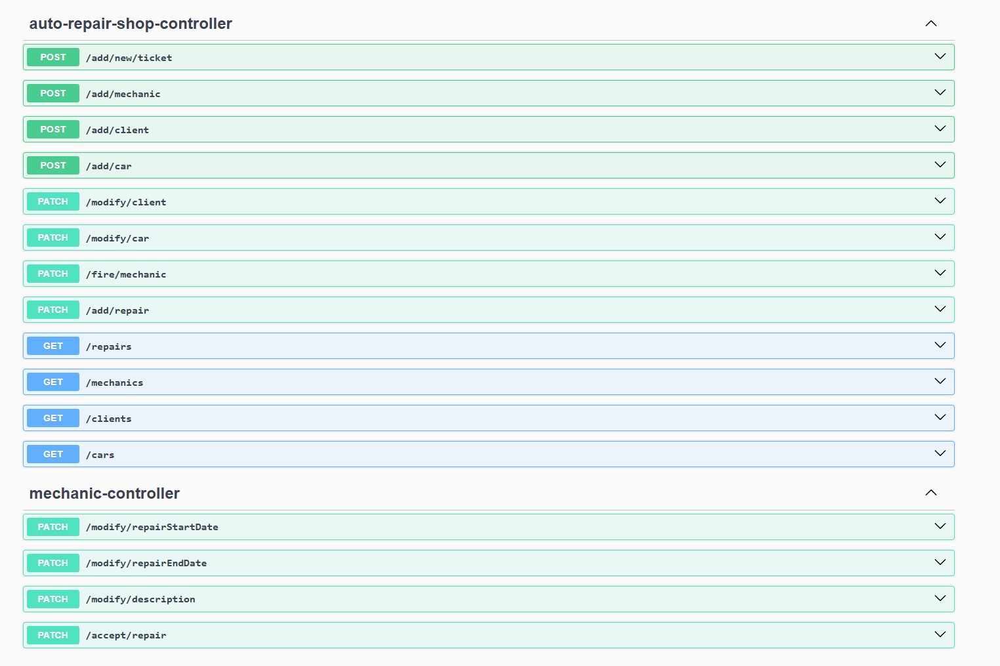

# AutoRepairShop

## About project
Rest application, which is created in Spring Boot. In car repair shop clients can add new tickets. Mechanics and admin can accept and manage them.
Frontend for this application is available on: https://github.com/dmarczuk/AutoRepairShopFrontend


## Main responsibilities application
<ul>
<li>Adding new ticket</li>
<li>Add and modify clients, cars, mechanics adn repairs</li>
<li>Display list of clients, cars, mechanics and repairs</li>
<li>Authorisation for mechanics and admin</li>
<li>Adding new ticket</li>
</ul>

## Endpoints



## Technologies used in project

  
  
  
  
  
  

<br>

## Installation and run


### 1️⃣ Clone the Repository
```sh
git clone https://github.com/dmarczuk/AutoRepairShop.git
cd dmarczuk/AutoRepairShop
```

### 2️⃣ Build & Run the Project
```sh
mvn spring-boot:run
```

### 3️⃣ Access Swagger UI
Once the application is running, open in browser:

Swagger UI: http://localhost:8080/swagger-ui.html

